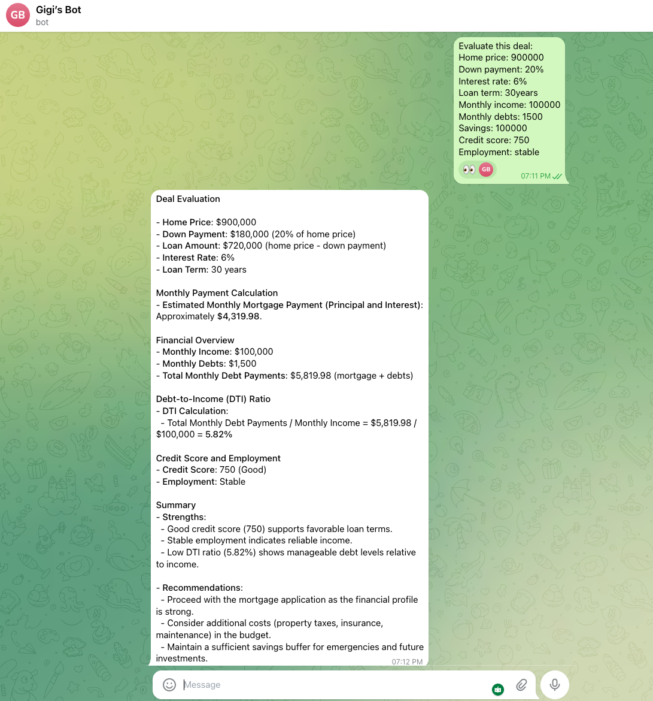

# Real Estate Analyzer

## Problem
Most buyers guess what they can afford and underestimate risk.

## Solution
A structured tool that evaluates affordability and investment potential.

## What it does
- Calculates monthly payment
- Evaluates debt-to-income ratio
- Estimates affordability range
- Provides a clear recommendation

## Output
- Monthly payment
- DTI ratio
- Safe budget
- Risk level
- Final verdict (Good / Risky / Not recommended)

## Stack
- Python
- Flask
- Custom financial logic

## Status
Working prototype tested locally.
